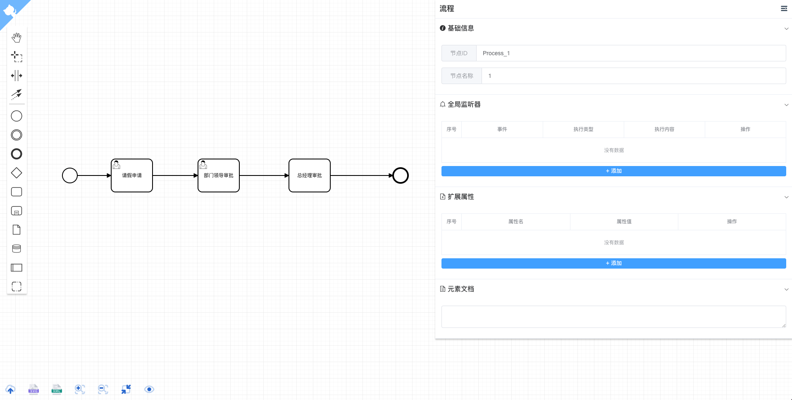

# bpmn-vue-activiti

## 项目简介
基于[Vue3.x](https://v3.vuejs.org/guide/introduction.html) + [Vite](https://vitejs.dev/) +[ bpmn-js](https://bpmn.io/toolkit/bpmn-js/) + [element-plus](https://element-plus.gitee.io/#/zh-CN) + tsx 实现的Activiti流程设计器

:smiley:[我是一个活生生的例子](http://42.192.95.146:18080/)

:kissing_smiling_eyes: 如果此项目对你有帮助，请记得给我一个小星星:star:

后端activiti7集成，[请戳这里](https://github.com/Yiuman/citrus/tree/master/citrus-workflow)

**友情链接：**蜜月大佬的vue2版本实现，[请戳这里](https://github.com/miyuesc/bpmn-process-designer)

## 项目特性

1. 全新的vue技术栈+tsx
2. 全数据驱动的模型组件，实现数据逻辑与组件的完全解耦

## 项目说明

bpmn相关的配置在`src/bpmn`目录下

- **conifg**   

  此目录下为bpmn相关节点的属性的数据驱动配置及相关逻辑（即主界面右手边的属性配置界面）

- **I18n**   

  翻译模块，里面定义了bpmn相关的中文翻译

- **resources**

  定义此了activiti的moddle的Json,用于扩展bpmn适配activiti,提供给modeler使用

- **store.ts**

  整个上下文的状态管理，里边获取并处理当前活动节点，初始化modeler，刷新节点等相关的主要操作
  
  

如果你需要扩展到你的项目中，你只需要在`config/modules`找到相关节点，并配置定义好你需要扩展的属性及实现相关逻辑即可，可参考现有实现的配置。

组件说明：相关使用到的组件都在`src/components`目录下

- **bpmn-actions** 为主页面下按钮就按钮执行逻辑的组件
- **button-render** 用于渲染iconfont按钮的组件
- **dynamic-binder** 全数据启动的核心组件，用于对象的模型的组件、数据、取值、设值的解耦，在此项目中用于配置相关节点的属性配置
- **modeler**  bpmn-modeler
- **panel** 流程节点的属性配置面板
- **sublist** 基于element-plus ElTable的可编辑表格

## 项目截图

